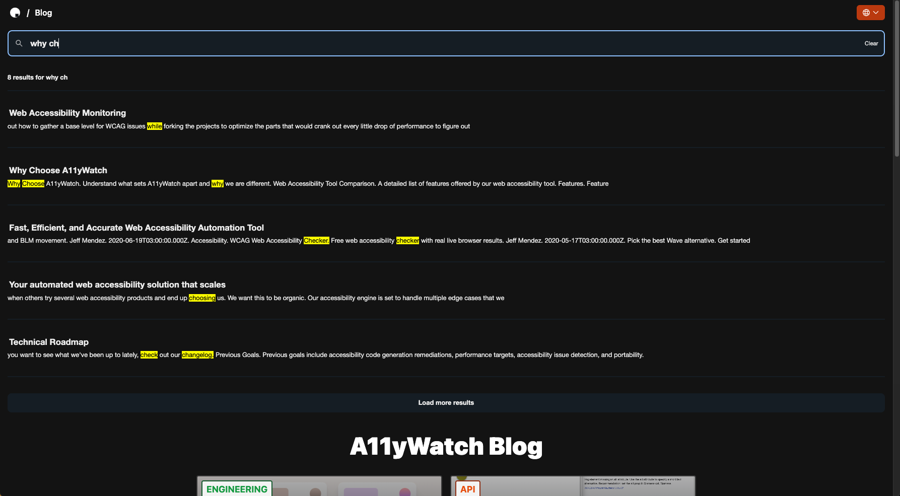

# auto-pagefind

Use [Pagefind](https://pagefind.app/) with any live server.

## Insallation

Install the modules required for the program.

1. `cargo install spider_cli`
1. `cargo install pagefind`
1. `cargo install auto-pagefind`

## Getting Started

1. Start the dev or prod instance on port 3000 and run `auto-pagefind` at the root directory of your next application to create your search index's and output the content into the `public` folder.

2. Optional: Add `data-pagefind-meta="url[href]"` on your meta `hrefLang` links example: `<link rel="alternate" hrefLang="en" href="https://a11ywatch.com/blog/version-your-proto-definitions-for-stablity" data-pagefind-meta="url[href]"/>` to replace the location of the links.

3. Setup pagefind client loading in the your project. You can use the [pagefind-react](./react) component with `npm install pagefind-react --save` for a drop in ready search.



## Options

Some optional options below.

```
auto-pagefind --help
Pagefind for next.js non output export applications. Fully crawl and index your app in one command.

Usage: auto-pagefind [OPTIONS]

Options:
  -d, --download-dir <DOWNLOAD_DIR>  The download directory for storing the static.html files
  -u, --url <URL>                    The website url
  -h, --help                         Print help
  -V, --version                      Print version
```

## CSP

You need to add the following header if csp is enabled `'wasm-unsafe-eval'`.